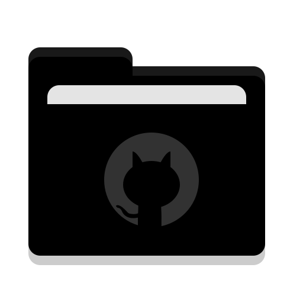

# COP-3330C-Module-3-SDLC-Project
This Repository will held documentation and Java files where contains the Local Library Patrons Data - LMS system. 

**Name:** Kenji Nakanishi 
**Course:** COP 3330C Object Oriented Programming 
**CRN:** 26824

**Description of the project: **

This console based app will allow librarians to add patrons data, load from a file stored in the local computer, remove patron, print the whole list, and exit.
Since it is very important to have interactive interface. The app displays messages informing the user where errors has been detected and prompt to fix them.

Also, a resource LocalLibraryPatronsDataSave.txt has been provided if librarian needs. 
** Highlight: They can provide them as well, just need to load to store the values in! 

** An screenshot of the console based NavigationMenu **

LMS Software Development Life Cycle Project: 
1. introduction
2. Requirements Definition 
3. Requirements Gathering
4. Implementation Plan
5. Testing Plan
6. Deployment 

Documentation has been updated for revision as well!

This console based app basically work with the below 3 files:

**LibraryApp.java** 
which contain the main method which will start the program

**Patron.java** 
which contains the formatting of how the user requested to be the input
example:
UniqueID-FirstName LastName-Addres-Overfue Fee
1234567-Kenji Nakanishi-12107 Bellsworth Way Orlando, FL 32837-200.00

**NavigationMenu.java** 
that holds most of the methods:
- AddingManually
- AddingFrmTxtFile
- RemovingByID
- DisplayList
- Exit
  These methods have been tested with a sample data stored under out/Patrons_jar/LocalLibraryDataSave.txt
  

The UML model is as follow:
Where LibraryApp creates NavigationMenu and this Uses & Stores Patron.

**Tools used:**
- Java language
- IDE: JetBrain IntelliJ IDE

